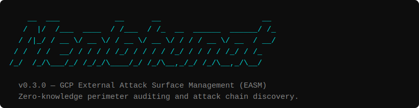

# menlohunt
### GCP External Attack Surface Management (EASM)

<p align="center">
  
</p>

Most cloud security tools (CSPMs) require administrative access: IAM credentials, service accounts, or agents. They tell you what your configuration says—**not what an attacker actually sees.**

**menlohunt** provides a zero-knowledge, "Outside-In" perspective of your Google Cloud Platform (GCP) perimeter. It mimics the reconnaissance phase of a motivated adversary to find architectural leaks that internal tools miss.

**No credentials. No agent. No cloud account required. Just an IP and fifteen seconds.**

---

## Why menlohunt?

If you rely solely on internal dashboards, you are operating with **"Insider Bias."** **menlohunt** exists to solve three critical problems:

### 1. Verification of the "Perimeter Illusion"
Firewall rules are complex. Between Hierarchical policies, Network Tags, and Load Balancer proxy rules, what your console says is "closed" might actually be reachable. **menlohunt** doesn't look at your rules; it tries to walk through the door. It provides the **ground-truth** of your exposure.

### 2. Discovering "Connective Tissue"
Traditional scanners look at one IP in a vacuum. **menlohunt** extracts name candidates from TLS certificates and Reverse DNS to pivot. If it finds a project name on a certificate, it immediately probes for related GCS buckets or Firebase databases that belong to that project but aren't hosted on that IP.

### 3. Cutting Through "Alert Fatigue"
Standard scanners bury you in a PDF of 400 "Medium" severity findings. **menlohunt** uses a **mathematical subset sum algorithm** to correlate findings. It recognizes that five "Low" findings sharing a `kubernetes` tag aren't noise—they are a high-priority **Attack Chain**.

---

## Key Features

- **GCP-Native Intelligence:** Purpose-built for GCP. It distinguishes between standard 403s and public-but-restricted GCS/Firebase endpoints. It knows the signatures of the GCP Metadata API and Cloud Run URLs.
- **Attack Chain Discovery:** Automatically groups 2-4 correlated findings into viable attack paths using mathematical scoring.
- **Ultra-Lightweight:** A single 10MB Go binary. Zero dependencies. No 500MB template repos or Python runtimes.
- **Speed:** Executes a five-phase scan (Ports, Protocols, HTTP, TLS, and GCP Surface) in roughly 15 seconds.
- **Air-Gapped & Portable:** Designed to fit in a recon directory. JSON-ready for SIEM pipelines (Splunk, ELK).

---

## The Five-Phase Scan

1.  **Port Discovery:** L7-aware TCP probing that identifies ports even behind "silent" cloud firewalls.
2.  **Protocol Probes:** Raw wire-protocol interaction with Redis, MongoDB, and Memcached to confirm unauthenticated access.
3.  **HTTP Fingerprinting:** Optimized path-grouping checks for Kubelets, Docker Daemons, MLflow, and more.
4.  **TLS Analysis:** Extracts internal IP leaks and GCP project identifiers from Subject Alternative Names (SAN).
5.  **GCP Surface Checks:** Active probing for exposed Metadata APIs, GCS buckets, and Firebase databases using discovered name candidates.

---

## Installation

Built with Go. No external dependencies.

```bash
git clone https://github.com/Nicholas-Kloster/menlohunt
cd menlohunt
go build -o menlohunt *.go
```

## Usage

### 1. Scan a target
```bash
./menlohunt scan -ip 34.120.X.X -out report.json
```

### 2. Generate a human-readable report
```bash
./menlohunt report -in report.json
```

### 3. Search and Filter
```bash
# Search for anything related to "docker"
./menlohunt search -in report.json -q docker

# Filter for Critical vulnerabilities
./menlohunt search -in report.json -sev CRITICAL
```

---

## How Attack Chaining Works

An open SSH port is a `LOW` severity finding. A leaked internal IP is `MEDIUM`.

**menlohunt** recognizes that if they share the same host and a "remote-access" tag, they represent a correlated path. The tool uses a subset sum threshold (default 15) to surface these chains, transforming a flat list of noise into a prioritized list of breaches-in-waiting.

## Semantic Intelligence: What Makes menlohunt Different

Most scanners produce network maps. **menlohunt** produces logical blueprints.

### 1. Port → Infrastructure (not just "Port 8082 is open")
- **Nmap:** "Port 8082 is open."
- **menlohunt:** "This is a WireGuard management node reading its peer list from a GCS bucket named `[COMPANY]-prod-usw2-catalog`."

Other tools give you a network map. menlohunt gives you the architecture behind it.

### 2. Extraction-Based Pivoting (The GCS Connection)
Generic tools scan the IP and stop at the IP. menlohunt performs **extraction-based pivoting**: it uses names found in `/debug/vars` (bucket names, project IDs, regions) to automatically probe related GCS buckets and Firebase databases in Phase 4.

You found a vulnerability on a Compute Engine VM. The loot is in a GCS Bucket. Other tools treat those as two separate universes. menlohunt treats them as one attack path.

### 3. Management Plane vs. Data Plane Awareness
Cloud tools suffer from **Port Bias**: they see WireGuard ports (51820) are closed and report "Your VPN is secure."

The reality: the Data Plane is fine. The Management Plane — the code that *controls* the VPN — is exposed. Developers routinely forget to firewall secondary ports like 8082/8086 because they don't think metrics are dangerous. menlohunt proves that **metrics are just as dangerous as a shell**.

### 4. Configuration vs. Reality (Bypassing IAM Blindness)
Tools like Wiz and Prisma Cloud read your Google Cloud API settings.
- **What they see:** "Firewall rule allows 8082." Flagged Medium.
- **What they miss:** The developer passed a plaintext bucket name as a command-line flag.

Those tools tell you the *rule* is bad. menlohunt proves the *payload* is lethal — it provides the evidence that turns an abstract warning into an emergency.

### 5. Semantic Parsing of `/debug/vars`
Nuclei has a template for `/debug/vars`. It reports: "Found expvar."

menlohunt parses the `cmdline` array and extracts strings matching `-bucketName`, `-dbPath`, `-secretKey`, `-region`. It performs keyword extraction on exposed endpoints to surface GCP assets — automatically.

---

## For the Red & Blue Teams
- **Red Teams:** Use it for "first-strike" recon. Map the attack surface in seconds without triggering heavy internal IAM-based alarms.
- **Blue Teams:** Use it for "Trust but Verify." Prove to stakeholders that your "internal-only" services are actually hidden from the public internet.

---

## Real-World Case Study: Breaking the Management Plane

During a zero-knowledge external scan against a GCP-native infrastructure provider, **menlohunt** identified two non-standard ports responding to HTTP. No credentials. No cloud console. No prior knowledge of the target.

### Scan Output

```text
[menlohunt] v0.3.0  target=34.X.X.X  timeout=4s  retries=1
[menlohunt] open ports: [8082, 8086]
[menlohunt] phase 2 — protocol probes + HTTP fingerprinting…
[menlohunt] phase 3 — TLS certificate analysis…
[menlohunt] phase 4 — GCP surface (GCS, Firebase, metadata, Cloud Run)…
[menlohunt] phase 5 — attack chain detection (threshold=15)…
[menlohunt] done — 8 findings, 10 chains in 9.1s  [C:0 H:4 M:4 L:0 I:0]
```

### The Money Finding

`/debug/vars` (Go expvar) was open on port 8082. It returned the full process command line:

```json
{
  "cmdline": [
    "/opt/app/bin/catalog-sync",
    "-logLevel", "info",
    "-bucketName", "[COMPANY]-prod-usw2-catalog",
    "-bucketPrefix", "peers/",
    "-region", "us-west-2"
  ]
}
```

### What That Tells You

| Finding | Significance |
|---------|-------------|
| `/opt/app/bin/catalog-sync` | Binary path confirms this is a managed node, not a honeypot |
| `[COMPANY]-prod-usw2-catalog` | GCS bucket name — instant pivot target for peer table enumeration |
| `us-west-2` | Region and node tier confirmed without any cloud credentials |
| Internal port `8085` (from 8086 expvar) | Private listener revealed — maps topology without touching it |

### The Attack Chain

```
[chain 1] score=21  tags=[info-disclosure, metrics, management-plane]
  MH-0004 → Management metrics exposed on port 8082 (Prometheus)
  MH-0006 → Go expvar /debug/vars leaked full process cmdline (port 8082)
  MH-0008 → Go expvar /debug/vars leaked full process cmdline (port 8086)
```

### Why Other Tools Miss This

| Tool | What It Sees |
|------|-------------|
| **Nmap** | "Port 8082 open." Full stop. |
| **Wiz / Prisma Cloud** | Firewall rule flagged Medium. Endpoint never pulled. |
| **Nuclei** | `/debug/vars` template fires — reports "Found expvar." No extraction. |
| **menlohunt** | Pulls `/debug/vars`, parses the `cmdline` JSON, extracts a GCS bucket name that maps the entire backend topology. No cloud credentials required. |

**The Data Plane (WireGuard) was properly firewalled. The Management Plane was naked.**

Most tools stop at "Port 8082 is open." **menlohunt** reads the response, identifies it as a management service, extracts a hidden GCS bucket name from the process flags, and checks that bucket for public exposure. It turns a network scan into a cloud asset discovery engine.

---
*Disclaimer: This tool is for authorized security auditing and educational purposes only.*
